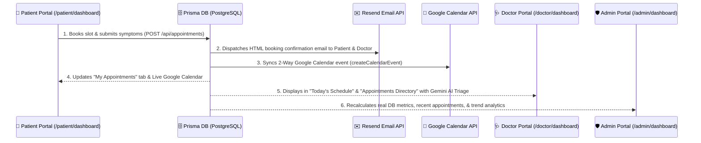

# Healthcare Appointment & Follow-up Manager

A production-grade healthcare appointment booking and follow-up platform built with **Next.js 15**, **PostgreSQL**, **Prisma**, **Google Gemini AI**, and **Google Calendar Integration**.

---

## 🌐 Live Hosted Application
- **Live Demo URL**: [https://healthcare-appointment-manager-silk.vercel.app/](https://healthcare-appointment-manager-silk.vercel.app/)
- **System Design Document**: [`SYSTEM_DESIGN.md`](SYSTEM_DESIGN.md)

---

## 🔄 Interconnected 3-Dashboard Workflow

All three user portals (**Patient**, **Doctor**, and **Admin**) are dynamically interconnected in real time via PostgreSQL database transactions, Resend Email API, and Google Calendar 2-way sync:



---

## ✨ Key Features & Technical Matrix

| Feature | Technical Implementation |
|---|---|
| **Role-Based Auth** | JWT + RBAC (`ADMIN`, `DOCTOR`, `PATIENT`) with httpOnly cookies |
| **Double-Booking Prevention** | PostgreSQL `SELECT FOR UPDATE` atomic database transactions |
| **Slot Hold Mechanism** | 5-minute exclusive slot hold with automatic background cron cleanup |
| **AI Pre-Visit Triage** | Google Gemini 2.5 Flash — urgency rating, chief complaint, doctor questions |
| **AI Post-Visit Summary** | Converts doctor's clinical notes & prescriptions into patient-friendly format |
| **Email Delivery Engine** | Multi-provider fallback (Gmail SMTP / SendGrid / Resend) with exponential backoff retries |
| **Google Calendar Sync** | OAuth 2.0 integration — automated creation, update, and deletion of calendar events |
| **Medication Reminders** | Generated from prescription dosage/frequency and dispatched via minute-cron worker |
| **Doctor Leave System** | Admin leave creation triggers cascading cancellation, calendar deletion, and email notification |
| **Audit Log System** | Comprehensive immutable logging of all critical platform actions |

---

## 🤖 LLM Prompts & Usage Guidance

### 1. Pre-Visit AI Symptom Summary Prompt
- **Trigger**: Patient submits symptom form prior to or during appointment confirmation.
- **Model**: `gemini-2.5-flash`
- **Prompt Structure**:
  ```text
  You are a medical AI assistant helping doctors prepare for patient visits.

  Analyze these patient symptoms and return a structured JSON response:

  Patient Symptoms:
  - Chief Complaint: <chiefComplaint>
  - Duration: <duration>
  - Severity (1-10): <severity>
  - Previous Conditions: <previousConditions>
  - Current Medicines: <currentMedicines>

  Return ONLY a valid JSON object with this exact structure:
  {
    "urgency": "LOW" | "MEDIUM" | "HIGH",
    "chiefComplaint": "concise one-line summary of main complaint",
    "doctorQuestions": ["question 1", "question 2", "question 3"]
  }
  ```

### 2. Post-Visit Patient-Friendly Summary Prompt
- **Trigger**: Doctor submits clinical notes, diagnosis, and prescriptions post-consultation.
- **Model**: `gemini-2.5-flash`
- **Prompt Structure**:
  ```text
  You are a medical AI helping patients understand their visit summary.

  Convert these clinical notes into simple, friendly, easy-to-understand language for a patient:

  Diagnosis: <diagnosis>
  Clinical Notes: <clinicalNotes>
  Prescriptions: <prescriptionList>
  Follow-up Date: <followUpDate>

  Write a warm, clear patient summary that:
  1. Explains the diagnosis in simple terms
  2. Lists medications and WHEN to take them clearly
  3. Mentions any important follow-up steps
  4. Uses encouraging, non-scary language
  ```

---

## 📅 Google Calendar API & OAuth 2.0 Setup Guide

1. **Create Google Cloud Console Project**:
   - Navigate to [Google Cloud Console](https://console.cloud.google.com/).
   - Create a new project named `Healthcare Appointment Manager`.
2. **Enable Google Calendar API**:
   - Go to **APIs & Services > Library**.
   - Search for **Google Calendar API** and click **Enable**.
3. **Configure OAuth Consent Screen**:
   - Select **External** user type.
   - Add scopes: `openid`, `email`, `profile`, `https://www.googleapis.com/auth/calendar.events`.
4. **Create OAuth 2.0 Credentials**:
   - Go to **APIs & Services > Credentials > Create Credentials > OAuth Client ID**.
   - Application type: **Web application**.
   - Authorized JavaScript origins: `http://localhost:3000` (or `https://your-domain.vercel.app`).
   - Authorized redirect URIs: `http://localhost:3000/api/calendar/callback`.
5. **Update `.env`**:
   ```env
   GOOGLE_CLIENT_ID="your-client-id.apps.googleusercontent.com"
   GOOGLE_CLIENT_SECRET="your-client-secret"
   GOOGLE_REDIRECT_URI="http://localhost:3000/api/calendar/callback"
   ```

---

## 🛠️ Local Installation & Setup Guide

### Prerequisites
- Node.js 18+
- PostgreSQL Database (Local or Neon Serverless DB)
- Google Gemini API Key

### Step-by-Step Instructions

```bash
# 1. Clone repository
git clone https://github.com/your-repo/healthcare-appointment-manager.git
cd healthcare-appointment-manager

# 2. Install dependencies
npm install

# 3. Environment configuration
cp .env.example .env
# Edit .env and supply DATABASE_URL, GEMINI_API_KEY, JWT_SECRET, etc.

# 4. Initialize Database Schema
npx prisma db push

# 5. Seed Initial Demo Users & Doctors (Optional)
npx tsx prisma/seed.ts

# 6. Start Development Server
npm run dev
```

Open [http://localhost:3000](http://localhost:3000) in your browser.

---

## 📋 Environment Variables Reference (`.env.example`)

| Variable | Description |
|---|---|
| `DATABASE_URL` | PostgreSQL connection string |
| `JWT_SECRET` | Secret key for JWT session tokens (min 32 chars) |
| `GEMINI_API_KEY` | Google Gemini AI API key |
| `RESEND_API_KEY` | Resend Email service API key |
| `GMAIL_USER` | Gmail address (optional SMTP fallback) |
| `GMAIL_APP_PASSWORD` | Gmail App Password (optional SMTP fallback) |
| `GOOGLE_CLIENT_ID` | Google OAuth Client ID |
| `GOOGLE_CLIENT_SECRET` | Google OAuth Client Secret |
| `GOOGLE_REDIRECT_URI` | Google OAuth Callback URL |
| `CRON_SECRET` | Security key for cron job HTTP authorization |

---

## 🗄️ Database Schema Summary

The platform uses Prisma ORM connected to PostgreSQL. Key relational models:
- **`User`**: Account credentials, roles (`ADMIN`, `DOCTOR`, `PATIENT`), and OAuth tokens.
- **`Doctor`**: Specialization, working hours JSON, fee, rating, and slot duration.
- **`Patient`**: Demographics and medical history links.
- **`DoctorLeave`**: Date ranges when doctor is unavailable.
- **`Appointment`**: Scheduled consultations linking patient, doctor, date, and status.
- **`SlotHold`**: 5-minute transient slot reservations.
- **`Symptom` & `SymptomSummary`**: Patient pre-visit inputs and AI triage findings.
- **`VisitNote` & `Prescription`**: Clinical diagnoses, doctor notes, and prescribed meds.
- **`MedicationReminder`**: Scheduled reminders generated per prescription.
- **`CalendarEvent`**: Sync tracking for Google Calendar event IDs.
- **`NotificationLog`**: Full audit trail of outbound emails and retry queue states.

---

## 🔌 API Reference

| Method | Endpoint | Description |
|---|---|---|
| `POST` | `/api/auth/register` | Register new Patient, Doctor, or Admin |
| `POST` | `/api/auth/login` | Authenticate user & issue JWT |
| `GET` | `/api/doctors` | List doctors with specialization filtering |
| `GET` | `/api/doctors/[id]/slots` | Get available time slots for doctor & date |
| `POST` | `/api/appointments/hold` | Place 5-minute exclusive hold on time slot |
| `POST` | `/api/appointments` | Book appointment (transaction-safe) |
| `POST` | `/api/appointments/[id]/symptoms` | Submit symptoms & trigger pre-visit AI summary |
| `POST` | `/api/doctor/appointments/[id]/notes` | Doctor submits clinical notes & prescriptions |
| `POST` | `/api/admin/doctors/[id]/leave` | Mark doctor leave & cascade cancel appointments |
| `GET` | `/api/cron/medication-reminders` | Cron worker to send due medication emails |
| `GET` | `/api/cron/email-retry` | Cron worker to retry failed notifications |
| `GET` | `/api/cron/cleanup-holds` | Cron worker to release expired slot holds |

---

## 📄 License
MIT License
