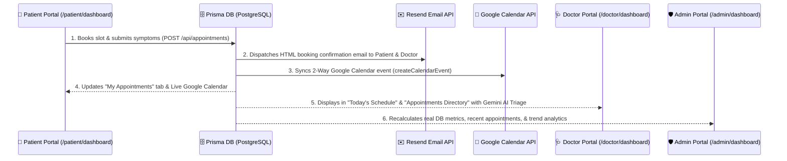

# Healthcare Appointment Manager

A production-grade healthcare appointment booking system built with **Next.js 15**, **PostgreSQL**, **Prisma**, **Google Gemini AI**, and **Google Calendar**.

## 🔄 Interconnected 3-Dashboard Workflow

All three user portals (**Patient**, **Doctor**, and **Admin**) are dynamically interconnected in real time via PostgreSQL database transactions, Resend Email API, and Google Calendar 2-way sync:



### 🌟 Real-Time Data Flow:
1. **👤 Patient Portal (`/patient/dashboard`)**: Patient chooses a doctor, date, and slot, then submits their chief complaint. `POST /api/appointments` uses PostgreSQL `SELECT FOR UPDATE` transactions to prevent double booking.
2. **✉️ Resend Email API**: Automatically dispatches HTML booking confirmation emails to both patient and doctor.
3. **📅 Google Calendar API**: Syncs 2-way calendar events onto doctor and patient practice schedules.
4. **🩺 Doctor Portal (`/doctor/dashboard`)**: The consultation instantly populates under *Today's Schedule* and *Appointments Directory* with Gemini AI triage urgency ratings.
5. **🛡️ Admin Portal (`/admin/dashboard`)**: Analytics dashboard recalculates live metrics (*Total Patients, Appointments, Recent Activity Logs*) directly from Prisma DB without any hardcoded numbers.

## ✨ Key Features

| Feature | Implementation |
|---|---|
| Role-Based Auth | JWT + RBAC (ADMIN / DOCTOR / PATIENT) |
| Slot Conflict Prevention | `SELECT FOR UPDATE` PostgreSQL transaction |
| Slot Hold Mechanism | 5-minute exclusive hold with auto-expiry |
| AI Pre-Visit Summary | Gemini 2.5 Flash — urgency, chief complaint, doctor questions |
| AI Post-Visit Summary | Patient-friendly language conversion |
| Email Notifications | Resend — 6 email types with retry queue |
| Google Calendar Sync | OAuth 2.0 — create/update/delete events |
| Medication Reminders | Auto-generated per prescription, sent by cron |
| Doctor Leave Management | Cascade cancel + notify + calendar delete |
| Audit Logs | Every critical action logged |
| Background Jobs | Upstash QStash cron workers |

## 🏗️ Tech Stack

- **Framework**: Next.js 15 (App Router, full-stack)
- **Language**: TypeScript (strict)
- **Styling**: Tailwind CSS
- **ORM**: Prisma
- **Database**: PostgreSQL (Neon)
- **Auth**: JWT + bcryptjs
- **AI**: Google Gemini 2.5 Flash
- **Email**: Resend
- **Calendar**: Google Calendar API
- **Background Jobs**: Upstash QStash
- **Deployment**: Vercel + Neon

## 🚀 Getting Started

### Prerequisites
- Node.js 18+
- PostgreSQL database (or Neon account)
- Google Gemini API key
- Resend API key
- Google Cloud OAuth credentials

### Setup

```bash
# 1. Clone the repo
git clone <repo-url>
cd healthcare-appointment-manager

# 2. Install dependencies
npm install

# 3. Configure environment
cp .env.example .env
# Fill in all values in .env

# 4. Setup database
npx prisma db push

# 5. Generate Prisma client
npx prisma generate

# 6. Run development server
npm run dev
```

Open [http://localhost:3000](http://localhost:3000)

## 📋 Environment Variables

See [`.env.example`](.env.example) for all required variables:

| Variable | Description |
|---|---|
| `DATABASE_URL` | Neon PostgreSQL connection string |
| `JWT_SECRET` | Secret for signing JWTs (min 32 chars) |
| `RESEND_API_KEY` | Resend email service key |
| `GEMINI_API_KEY` | Google AI Studio API key |
| `GOOGLE_CLIENT_ID` | Google OAuth client ID |
| `GOOGLE_CLIENT_SECRET` | Google OAuth client secret |
| `GOOGLE_REDIRECT_URI` | OAuth callback URL |
| `CRON_SECRET` | Secret for authenticating cron jobs |

## 🗄️ Database Schema

15 tables covering the full domain model:

```
users → doctors / patients
appointments → symptoms → symptom_summaries (AI)
appointments → visit_notes → prescriptions → medication_reminders
appointments → calendar_events
notification_logs (email audit trail)
audit_logs (all admin actions)
doctor_leaves
slot_holds
```

## 🔌 API Reference

| Method | Endpoint | Description |
|---|---|---|
| POST | `/api/auth/register` | Register (PATIENT/DOCTOR/ADMIN) |
| POST | `/api/auth/login` | Login |
| GET | `/api/auth/me` | Current user |
| POST | `/api/auth/logout` | Logout |
| GET | `/api/doctors` | List doctors (filterable) |
| GET | `/api/doctors/[id]/slots` | Available slots for date |
| POST | `/api/appointments/hold` | Hold a slot (5 min) |
| POST | `/api/appointments` | Book appointment |
| GET | `/api/appointments/[id]` | Appointment detail |
| PUT | `/api/appointments/[id]` | Cancel / Reschedule |
| POST | `/api/appointments/[id]/symptoms` | Submit symptoms (triggers AI) |
| GET | `/api/patient/dashboard` | Patient dashboard data |
| GET | `/api/doctor/dashboard` | Doctor dashboard data |
| POST | `/api/doctor/appointments/[id]/notes` | Submit visit notes |
| GET | `/api/admin/analytics` | Platform analytics |
| GET | `/api/admin/doctors` | List all doctors |
| POST | `/api/admin/doctors` | Create doctor |
| PUT | `/api/admin/doctors/[id]` | Update doctor |
| DELETE | `/api/admin/doctors/[id]` | Delete doctor |
| POST | `/api/admin/doctors/[id]/leave` | Mark doctor leave (cascade) |
| GET | `/api/calendar/auth` | Google OAuth initiation |
| GET | `/api/calendar/callback` | Google OAuth callback |
| GET | `/api/cron/cleanup-holds` | Clean expired slot holds |
| GET | `/api/cron/email-retry` | Retry failed emails |
| GET | `/api/cron/medication-reminders` | Send due reminders |

## ⚙️ Cron Job Setup (Upstash QStash)

Configure these schedules in Upstash QStash:

| Job | Schedule | Endpoint |
|---|---|---|
| Cleanup slot holds | Every minute | `GET /api/cron/cleanup-holds` |
| Email retry queue | Every 5 minutes | `GET /api/cron/email-retry` |
| Medication reminders | Every minute | `GET /api/cron/medication-reminders` |

All cron requests must include header: `x-cron-secret: <CRON_SECRET>`

## 🏥 User Flows

### Patient Booking Flow
1. Register → Login as PATIENT
2. Browse doctors by specialization
3. Select date → View available slots
4. Click slot → 5-min hold created
5. Fill symptom form
6. Confirm → Appointment booked
7. Confirmation email + Google Calendar event created
8. AI analyzes symptoms → urgency + doctor questions generated

### Doctor Visit Flow
1. Login as DOCTOR
2. View today's dashboard — urgent cases highlighted
3. Click patient → View symptoms + AI summary
4. After visit: Enter clinical notes + diagnosis + prescription
5. AI generates patient-friendly summary
6. Medication reminders auto-created for prescriptions

### Admin Leave Flow
1. Login as ADMIN
2. Go to doctor management → Mark leave dates
3. System finds all confirmed appointments in range
4. Auto-cancels appointments → sends emails to patients
5. Google Calendar events deleted
6. Full audit trail written

## 🔒 Security

- Passwords hashed with bcrypt (12 rounds)
- httpOnly JWT cookies (7-day expiry)
- Role-based middleware on all protected routes
- Cron endpoints protected by `CRON_SECRET`
- SQL injection prevented via Prisma parameterized queries

## 📦 Deployment

### Vercel
```bash
# Install Vercel CLI
npm i -g vercel

# Deploy
vercel --prod
```

Set all environment variables in Vercel dashboard.

### Database
Use [Neon](https://neon.tech) — free tier supports this project.

After deploying, run:
```bash
npx prisma db push
```

## 📝 License

MIT
